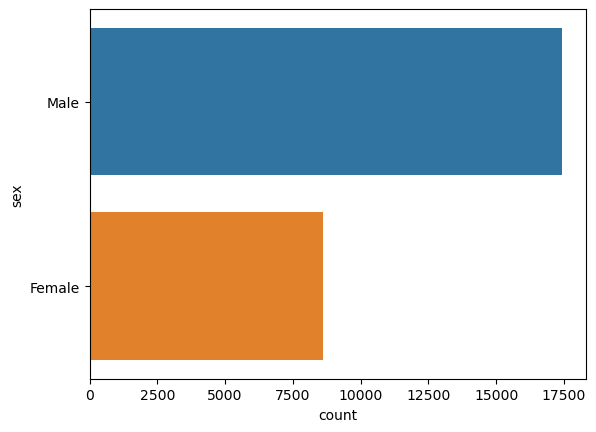
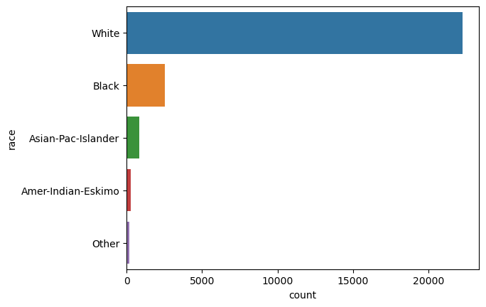
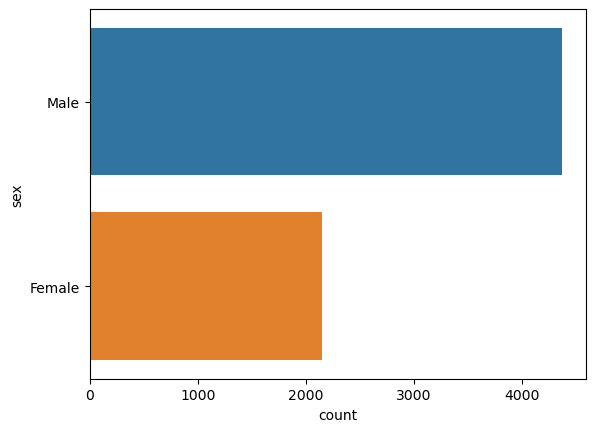
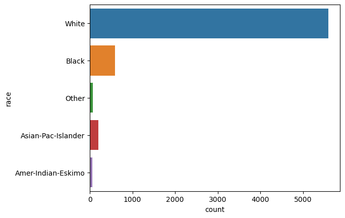

# Model Card

## Model Details
### Owner
Beatriz Albiero & Udacity

### Intended Use
This is a logistic regression model that aims to classify whether or not an individual has an income of over $50k given several demographic features.

## Training Data
The model was trained on the UCI Census Income Dataset, which was split into 80% for training and 20% for evaluation. Here we display important class imbalances across the features of race and sex.

## Evaluation Data
 Like the training set, we provide graphs showing the class imbalances across the features of race and sex in the evaluation set.
 
 

## Metrics
This model has obtained a precision of 0.71 points, a recall of 0.26 and a F-Beta of 0.38.

## Ethical Considerations
This dataset is class-imbalanced in many sensitive cases. We can see for example that there is twice as much Male individuals than Female individuals. In the case of race, there is almost six times more white individuals than all the other races combined.

## Caveats and Recommendations
We do not recommend using this model's output as a fair and realistic income predictor because of its known class imbalanced characteristic across sensitive features. We strongly recommend manual interventions prior to use. 
